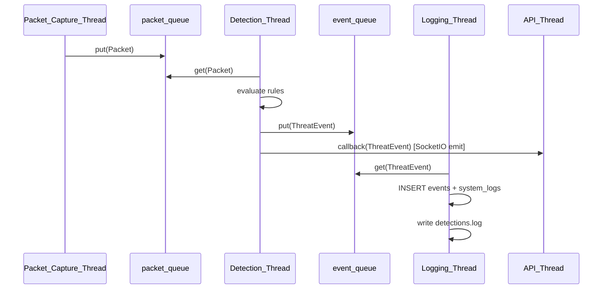
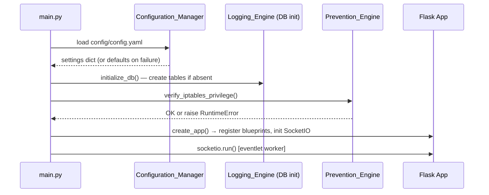

# Design Document: NetGuard IDPS

## Overview

NetGuard is an Explainable Intrusion Detection and Prevention System (IDPS) that runs entirely on a single Linux machine. It captures live network traffic via Scapy, classifies packets against five detection rule engines (SYN Flood, Port Scan, SQL Injection, Brute Force, ARP Spoofing), automatically blocks confirmed attackers via iptables, and presents every security decision with a plain-English explanation through a live SOC-style dashboard.

The system is designed for resource-constrained environments — schools, colleges, startups — where enterprise-grade security tooling is unavailable. The entire attack-to-block-to-explanation flow must complete reliably within 90 seconds for demonstration purposes and within tight real-time latency budgets for production use.

### Goals

- Zero external dependencies beyond the Python 3.11+ ecosystem and OS-level iptables
- All five detection rules operational with configurable thresholds, no code changes required
- Every Threat_Event accompanied by a human-readable Explanation
- Full audit trail in SQLite + three rotating log files
- Live SOC dashboard with sub-second refresh over SocketIO

### Non-Goals

- Multi-host / distributed deployment
- Cloud integration
- Authentication or multi-user access control
- Packet decryption or TLS inspection

---

## Architecture

### High-Level Component Diagram

```mermaid
graph TD
    NIC[Network Interface Card]
    CE[Capture_Engine\nScapy sniff() daemon thread]
    PD[Packet_Decoder\npacket_decoder.py]
    DE[Detection_Engine\nDetection_Thread]
    RE[Rule_Engine\n5 rule modules]
    EE[Explainability_Engine\nexplain service]
    PE[Prevention_Engine\niptables service]
    LE[Logging_Engine\nLogging_Thread]
    DB[(SQLite\nnetguard.db)]
    API[REST_API\nFlask + Flask-SocketIO]
    CM[Configuration_Manager\nconfig.yaml]
    WM[Whitelist_Manager]
    FE[Dashboard\nvanilla JS + Chart.js]

    NIC -->|raw packets| CE
    CE -->|raw packet queue| PD
    PD -->|normalized Packet| DE
    DE -->|Packet| RE
    RE -->|ThreatEvent| EE
    EE -->|Explanation| PE
    PE -->|block command| iptables[(iptables)]
    PE -->|ThreatEvent + block| LE
    LE -->|INSERT| DB
    LE -->|write| LOGS[logs/*.log]
    API -->|query/command| CM
    API -->|query/command| WM
    API -->|query| DB
    API -->|emit| FE
    FE -->|HTTP + WS| API
    CM -->|settings| DE
    CM -->|settings| PE
    WM -->|whitelist check| PE
```

### Threading Model

NetGuard uses four long-running threads plus the main Flask/eventlet thread:

| Thread | Role | Communication |
|--------|------|---------------|
| `Packet_Capture_Thread` | Runs Scapy `sniff()` in daemon mode; one packet at a time forwarded to decoder | Puts decoded Packet into `packet_queue` (thread-safe `queue.Queue`) |
| `Detection_Thread` | Consumes `packet_queue`; runs all enabled rules; emits ThreatEvents | Puts ThreatEvents into `event_queue` |
| `Logging_Thread` | Consumes `event_queue`; writes to DB + log files | Reads from `event_queue`; writes to DB via SQLAlchemy session |
| `Expiry_Thread` | Polls `blocked_ips` table; removes expired iptables rules | Reads DB; executes iptables -D; updates DB |
| `API_Thread` | Flask + eventlet; serves HTTP and SocketIO | Reads shared `MonitoringState` object; emits SocketIO events on ThreatEvent receipt via callback |

All cross-thread communication uses `queue.Queue` instances. Threads MUST NOT call methods on each other directly. Shutdown is coordinated via `threading.Event` objects.



### Layered Architecture

```
Flask Routes (thin — validate input, delegate, return JSON)
        ↓
Service Layer (business logic — MonitorService, DetectionService, BlockService, WhitelistService, LogService, StatsService)
        ↓
Repository Layer (DB access — EventRepository, BlockRepository, WhitelistRepository, LogRepository, SettingsRepository)
        ↓
SQLAlchemy ORM Models
        ↓
SQLite (database/netguard.db)
```

No route handler contains business logic. No service directly builds SQL strings.

### Startup Sequence



Entire sequence must complete within 10 seconds (Requirement 1.7).

---

## Components and Interfaces

### Configuration_Manager (`backend/services/config_service.py`)

Reads `config/config.yaml` on startup. Falls back to built-in defaults if file is absent or unparseable. Applies updated values to the in-memory `Settings` object on PUT /settings.

```python
class ConfigurationManager:
    def load(self) -> Settings
    def get(self, key: str) -> Any
    def update(self, updates: dict[str, Any]) -> None  # validates + persists
    def validate_settings(self, updates: dict) -> list[str]  # returns list of invalid field names
```

**Settings dataclass** (canonical defaults):

| Key | Type | Default | Range |
|-----|------|---------|-------|
| `network_interface` | str | `""` | any non-empty string |
| `syn_flood_threshold` | int | 100 | ≥ 1 |
| `syn_flood_window` | int | 3 | 1–60 |
| `port_scan_threshold` | int | 20 | ≥ 1 |
| `port_scan_window` | int | 10 | 1–60 |
| `brute_force_threshold` | int | 10 | ≥ 1 |
| `brute_force_window` | int | 60 | 1–300 |
| `block_duration` | int | 120 | 1–3600 |
| `dashboard_refresh_interval` | int | 1 | 1–60 |
| `rules_enabled` | dict[str, bool] | all True | — |

---

### Capture_Engine (`detection/capture/sniffer.py`)

Wraps Scapy's `sniff()` function in a daemon thread. On each packet, calls `Packet_Decoder.decode()` and puts the result on `packet_queue`.

```python
class CaptureEngine:
    def start(self, interface: str) -> None     # spawns Packet_Capture_Thread
    def stop(self) -> None                       # sets stop_event, joins thread
    def _capture_loop(self) -> None              # Scapy sniff() callback
    def _on_packet(self, raw_pkt) -> None        # calls decoder, puts on queue
```

`stop_event: threading.Event` — signals the capture loop to exit cleanly.

---

### Packet_Decoder (`detection/parsers/packet_decoder.py`)

Converts a raw Scapy packet to a normalized `Packet` dataclass. Must complete within 10 ms. Must never propagate an unhandled exception.

```python
@dataclass
class Packet:
    src_ip: str
    dst_ip: str
    src_port: Optional[int]
    dst_port: Optional[int]
    protocol: str          # TCP | UDP | ICMP | ARP | UNKNOWN
    flags: Optional[str]   # TCP flags string, e.g. "S" for SYN
    timestamp: str         # UTC ISO-8601
    length: int
    payload: Optional[bytes]

class PacketDecoder:
    def decode(self, raw_pkt) -> Optional[Packet]
```

Returns `None` and logs a WARNING on decoding failure; never raises.

---

### Detection_Engine (`backend/services/detection_service.py`)

Consumes `packet_queue` in a dedicated thread. Maintains a `Flow_Tracker` per rule. Calls `rule.process_packet()` and `rule.evaluate()` for all enabled rules on each packet. On a returned `ThreatEvent`, forwards to `Explainability_Engine`, then puts on `event_queue`.

```python
class DetectionEngine:
    def start(self) -> None
    def stop(self) -> None
    def _detection_loop(self) -> None
    def _dispatch(self, packet: Packet) -> None
    def reload_rules(self) -> None
```

**Cooldown enforcement**: A `dict[tuple[str, str], tuple[Severity, float]]` maps `(source_ip, rule_name)` → `(last_severity, emit_time)`. A new event for the same key within 10 seconds is only emitted if `new_severity > last_severity`.

---

### Rule Interface (`detection/rules/base_rule.py`)

```python
from abc import ABC, abstractmethod

class BaseRule(ABC):
    rule_name: str
    attack_type: str
    enabled: bool

    @abstractmethod
    def initialize(self) -> None: ...

    @abstractmethod
    def process_packet(self, packet: Packet) -> None: ...

    @abstractmethod
    def evaluate(self) -> Optional[ThreatEvent]: ...

    @abstractmethod
    def generate_event(self) -> ThreatEvent: ...

    @abstractmethod
    def explain(self, event: ThreatEvent) -> Explanation: ...

    @abstractmethod
    def cleanup(self) -> None: ...
```

**Flow_Tracker pattern** (used in every volumetric rule):

```python
# Per rule, keyed by source_ip
flow_tracker: dict[str, FlowData]

@dataclass
class FlowData:
    timestamps: deque  # collections.deque(maxlen=<window_size * max_rate>)
    ports: set         # for port scan rule only
    macs: dict         # for ARP spoof rule only
```

---

### Rule Implementations

#### `detection/rules/syn_flood.py` — `SynFloodRule`

- Tracks TCP SYN packets per source IP using a `deque` of timestamps.
- Removes entries older than `syn_flood_window` seconds on each evaluation.
- Severity tiers: 100–199 → Medium, 200–399 → High, ≥ 400 → Critical.
- Confidence: `round(min(count / threshold, 2.0) / 2.0 * 100)`, capped at 100.

#### `detection/rules/port_scan.py` — `PortScanRule`

- Tracks unique destination ports per source IP using a `set` of `(dst_ip, dst_port)` tuples within the sliding window.
- Severity tiers: 20–39 → Medium, 40–79 → High, ≥ 80 → Critical.
- Confidence: `round(min(unique_count / threshold, 2.0) / 2.0 * 100)`, capped at 100.

#### `detection/rules/sql_injection.py` — `SqlInjectionRule`

- Inspects TCP payload of HTTP packets (dst_port 80 or 443) using case-insensitive regex.
- Patterns: `' OR`, `UNION SELECT`, `DROP TABLE`, `--`, `xp_cmdshell`.
- First detection from an IP → severity High; repeat detection → severity Critical.
- Confidence always 100.
- No threshold; single matching payload triggers event.

#### `detection/rules/brute_force.py` — `BruteForceRule`

- Tracks authentication-failure indicators per source IP: SSH (port 22), HTTP 401 responses (port 80/443), FTP (port 21).
- Severity tiers: 10–19 → Medium, 20–39 → High, ≥ 40 → Critical.
- Confidence: `round(min(failure_count / threshold, 2.0) / 2.0 * 100)`, capped at 100.

#### `detection/rules/arp_spoof.py` — `ArpSpoofRule`

- Maintains `ip_to_macs: dict[str, set[str]]` — maps each IP address to observed MAC addresses from ARP replies.
- Triggers when `len(macs_for_ip) >= 2`.
- Severity always High.
- Confidence: 97 for exactly 2 MACs, 100 for ≥ 3 MACs.

---

### Explainability_Engine (`backend/services/explain_service.py`)

Converts a `ThreatEvent` to an `Explanation` within 50 ms.

```python
@dataclass
class Explanation:
    attack_name: str
    rule_triggered: str
    plain_english_text: str     # ≤ 500 chars, non-empty
    evidence: dict              # structured evidence fields
    confidence_score: int       # 0–100
    severity: str               # Low | Medium | High | Critical
    recommendation: str

class ExplainabilityEngine:
    def explain(self, event: ThreatEvent) -> Explanation
    def _build_text(self, event: ThreatEvent) -> str
    def _get_recommendation(self, attack_type: str) -> str
    def _fallback_explanation(self, event: ThreatEvent) -> Explanation
```

**Explanation templates** (filled from `ThreatEvent` evidence dict):

| Attack | Template |
|--------|----------|
| SYN Flood | `"Detected {count} SYN packets from {src_ip} within {window}s. The threshold of {threshold} was exceeded. {action}."` |
| Port Scan | `"Detected connection attempts to {port_count} unique ports from {src_ip} within {window}s. {action}."` |
| SQL Injection | `"Detected SQL injection pattern '{pattern}' in HTTP request from {src_ip} to {dst_ip}. {action}."` |
| Brute Force | `"Detected {count} authentication failures from {src_ip} within {window}s targeting {service}. {action}."` |
| ARP Spoofing | `"Detected conflicting ARP responses for IP {ip}: MAC addresses {macs}. {action}."` |

**Recommendations** (static, keyed by attack_type):

| Attack | Recommendation |
|--------|----------------|
| SYN Flood | "Investigate the source host and verify whether the traffic is legitimate." |
| Port Scan | "Review exposed services and verify firewall rules." |
| SQL Injection | "Inspect application logs and validate input sanitization on affected endpoints." |
| Brute Force | "Enable account lockout policies and review authentication logs." |
| ARP Spoofing | "Verify gateway configuration and inspect network devices for unauthorized ARP entries." |

---

### Prevention_Engine (`backend/services/prevention_service.py`)

Receives a `ThreatEvent` (with attached `Explanation`). Checks `Whitelist_Manager`. If not whitelisted, calls iptables. Persists block record.

```python
class PreventionEngine:
    def handle_event(self, event: ThreatEvent, explanation: Explanation) -> None
    def block_ip(self, ip: str, reason: str, event_id: str) -> bool
    def unblock_ip(self, ip: str) -> bool
    def _run_iptables(self, cmd: str) -> bool
    def verify_privileges(self) -> None    # called at startup
```

iptables commands:
- Block: `iptables -I INPUT -s <ip> -j DROP`
- Unblock: `iptables -D INPUT -s <ip> -j DROP`

Executed via: `subprocess.run(shlex.split(cmd), capture_output=True, timeout=5)`

**Duplicate block handling**: Before issuing a new iptables command, `PreventionEngine` queries `blocked_ips` for an active record with the same `ip_address`. If found, it extends `expires_at` by `block_duration` without issuing a duplicate rule.

---

### Whitelist_Manager (`backend/services/whitelist_service.py`)

```python
class WhitelistManager:
    def is_whitelisted(self, ip: str) -> bool   # O(1) lookup via in-memory set
    def add(self, ip: str, description: str, created_by: str) -> None
    def remove(self, ip: str) -> None
    def get_all(self) -> list[WhitelistEntry]
    def _sync_from_db(self) -> None             # called on startup + after mutations
```

Maintains an in-memory `set[str]` mirror of the `whitelist` table for O(1) lookups during high-frequency packet processing.

---

### Logging_Engine (`backend/services/log_service.py`)

Consumes `event_queue` in a dedicated `Logging_Thread`. Persists `ThreatEvent` + `Explanation` to DB. Writes structured log lines to the three log files. Uses Python's `logging` module with file handlers.

```python
class LoggingEngine:
    def start(self) -> None
    def stop(self) -> None
    def _logging_loop(self) -> None
    def log_event(self, event: ThreatEvent, explanation: Explanation) -> None
    def log_system(self, level: str, module: str, event: str, message: str) -> None
```

Log files:
- `logs/system.log` — INFO-level lifecycle events
- `logs/detections.log` — every ThreatEvent detection + block action
- `logs/errors.log` — WARNING / ERROR / CRITICAL from all modules

---

### REST API (`backend/routes/`)

All routes are thin Flask blueprints that validate input, delegate to the appropriate service, and return the standard JSON envelope.

**Standard response envelope:**
```json
{ "success": true, "message": "OK", "data": { ... } }
{ "success": false, "error": "Description", "code": 422 }
```

#### Endpoint Table

| Method | Path | Handler | Description |
|--------|------|---------|-------------|
| GET | `/api/v1/health` | `health_bp` | Liveness check — returns `{"status": "ok"}` |
| GET | `/api/v1/status` | `status_bp` | Monitoring status, uptime, thread state |
| POST | `/api/v1/monitor/start` | `monitor_bp` | Start capture on specified interface |
| POST | `/api/v1/monitor/stop` | `monitor_bp` | Stop capture |
| GET | `/api/v1/monitor/interfaces` | `monitor_bp` | List available network interfaces |
| POST | `/api/v1/detect` | `detect_bp` | Submit a raw packet for manual analysis |
| GET | `/api/v1/detections` | `detections_bp` | Paginated list; filter by severity/type/ip/date |
| GET | `/api/v1/detections/{event_id}` | `detections_bp` | Single event by event_id |
| POST | `/api/v1/block` | `block_bp` | Manually block an IP |
| POST | `/api/v1/unblock` | `block_bp` | Remove block for an IP |
| GET | `/api/v1/blocked` | `block_bp` | All active blocks |
| GET | `/api/v1/whitelist` | `whitelist_bp` | All whitelist entries |
| POST | `/api/v1/whitelist` | `whitelist_bp` | Add IP to whitelist |
| DELETE | `/api/v1/whitelist/{ip}` | `whitelist_bp` | Remove IP from whitelist |
| GET | `/api/v1/dashboard` | `dashboard_bp` | Full dashboard snapshot (KPIs + recent events) |
| GET | `/api/v1/dashboard/live` | `dashboard_bp` | Lightweight live stats (packets/s, threat count) |
| GET | `/api/v1/statistics` | `stats_bp` | Aggregate detection statistics |
| GET | `/api/v1/statistics/rules` | `stats_bp` | Per-rule detection counts and performance |
| GET | `/api/v1/evidence/{event_id}` | `evidence_bp` | Full Explanation for a specific event |
| GET | `/api/v1/logs` | `logs_bp` | Paginated system logs with filters |
| PUT | `/api/v1/settings` | `settings_bp` | Update configuration values |

---

### SocketIO Events

Flask-SocketIO with eventlet worker. Monkey-patching applied at module entry point (`backend/api/__init__.py`) before any other imports.

**Server → Client:**

| Event | Payload | Trigger |
|-------|---------|---------|
| `new_threat` | Full `ThreatEvent` + `Explanation` dict | On every emitted ThreatEvent |
| `ip_blocked` | `{ip, reason, blocked_at, expires_at}` | On successful iptables block |
| `ip_unblocked` | `{ip}` | On successful iptables unblock |
| `live_stats` | `{packets_per_sec, active_threats, alerts_today}` | Every 1 s while monitoring |
| `monitoring_status` | `{active: bool}` | On monitor start/stop |

**Client → Server:**

| Event | Payload | Response |
|-------|---------|----------|
| `request_live_stats` | — | Server emits `live_stats` immediately |

---

### Dashboard Frontend (`frontend/`)

Single-page application using vanilla JavaScript ES6 modules + Chart.js + Socket.IO client. No build step required.

**Pages/Routes** (served by Flask):

| URL | View |
|-----|------|
| `/` | Dashboard — KPIs, traffic graph, doughnut, threat timeline, evidence panel |
| `/threats` | Full threat list with filters |
| `/blocked` | Blocked IPs management |
| `/whitelist` | Whitelist management |
| `/logs` | Log viewer with search/filter |
| `/rules` | Detection rules configuration |
| `/settings` | System settings |
| `/about` | About / documentation |

**JS Modules** (`frontend/js/`):

- `dashboard.js` — KPI cards, chart updates, SocketIO listener
- `charts.js` — Chart.js initialization and update helpers
- `threats.js` — Threat list page
- `blocked.js` — Block management page
- `whitelist.js` — Whitelist page
- `logs.js` — Log viewer
- `rules.js` — Rules config page
- `settings.js` — Settings form
- `socket.js` — SocketIO connection management + reconnect logic
- `api.js` — Fetch wrapper with standard envelope handling

**Color Palette (dark theme):**

| Token | Hex |
|-------|-----|
| Background | `#0F172A` |
| Card background | `#1E293B` |
| Border | `#334155` |
| Success | `#22C55E` |
| Warning | `#FACC15` |
| Danger | `#EF4444` |
| Critical | `#DC2626` |
| Info | `#3B82F6` |

---

## Data Models

### SQLAlchemy ORM Models (`backend/models/`)

#### `Event` (`events` table)

```python
class Event(Base):
    __tablename__ = "events"

    id           = Column(Integer, primary_key=True, autoincrement=True)
    event_id     = Column(String(36), unique=True, nullable=False)  # UUID4
    timestamp    = Column(String(30), nullable=False)               # UTC ISO-8601
    attack_type  = Column(String(50), nullable=False)
    source_ip    = Column(String(45), nullable=False)               # IPv4 or IPv6
    destination_ip = Column(String(45))
    source_port  = Column(Integer)
    destination_port = Column(Integer)
    protocol     = Column(String(10))
    rule_name    = Column(String(50), nullable=False)
    severity     = Column(String(10), nullable=False)               # Low/Medium/High/Critical
    confidence   = Column(Integer, nullable=False)                  # CHECK 0–100
    packet_count = Column(Integer)
    evidence     = Column(Text)                                     # JSON string
    explanation  = Column(Text)                                     # plain_english_text
    recommendation = Column(Text)
    blocked      = Column(Boolean, default=False)

    __table_args__ = (
        CheckConstraint("confidence BETWEEN 0 AND 100", name="ck_confidence_range"),
    )
```

#### `BlockedIP` (`blocked_ips` table)

```python
class BlockedIP(Base):
    __tablename__ = "blocked_ips"

    id           = Column(Integer, primary_key=True, autoincrement=True)
    event_id     = Column(String(36), ForeignKey("events.event_id"), nullable=False)
    ip_address   = Column(String(45), nullable=False)
    blocked_at   = Column(String(30), nullable=False)    # UTC ISO-8601
    expires_at   = Column(String(30), nullable=False)    # UTC ISO-8601
    unblock_time = Column(String(30))
    reason       = Column(String(50))
    active       = Column(Boolean, default=True)
```

#### `WhitelistEntry` (`whitelist` table)

```python
class WhitelistEntry(Base):
    __tablename__ = "whitelist"

    id          = Column(Integer, primary_key=True, autoincrement=True)
    ip_address  = Column(String(45), unique=True, nullable=False)
    description = Column(Text)
    created_at  = Column(String(30), nullable=False)     # UTC ISO-8601
    created_by  = Column(String(100))
```

#### `DetectionRule` (`detection_rules` table)

```python
class DetectionRule(Base):
    __tablename__ = "detection_rules"

    id             = Column(Integer, primary_key=True, autoincrement=True)
    rule_name      = Column(String(50), unique=True, nullable=False)
    attack_type    = Column(String(50), nullable=False)
    threshold      = Column(Integer, nullable=False)
    severity       = Column(String(10))
    block_duration = Column(Integer)
    enabled        = Column(Boolean, default=True)
    priority       = Column(Integer)
    description    = Column(Text)
```

#### `Setting` (`settings` table)

```python
class Setting(Base):
    __tablename__ = "settings"

    key        = Column(String(100), primary_key=True)
    value      = Column(Text, nullable=False)
    updated_at = Column(String(30))
```

#### `SystemLog` (`system_logs` table)

```python
class SystemLog(Base):
    __tablename__ = "system_logs"

    id        = Column(Integer, primary_key=True, autoincrement=True)
    timestamp = Column(String(30), nullable=False)
    level     = Column(String(10), nullable=False)
    module    = Column(String(50))
    event     = Column(String(100))
    message   = Column(Text)
    metadata  = Column(Text)    # JSON string
```

---

### Internal Data Transfer Objects

```python
@dataclass
class ThreatEvent:
    event_id:       str         # uuid4 string
    timestamp:      str         # UTC ISO-8601
    attack_type:    str
    source_ip:      str
    destination_ip: Optional[str]
    source_port:    Optional[int]
    destination_port: Optional[int]
    protocol:       str
    rule_name:      str
    severity:       str         # Low | Medium | High | Critical
    confidence:     int         # 0–100
    packet_count:   int
    evidence:       dict

@dataclass
class Explanation:
    attack_name:       str
    rule_triggered:    str
    plain_english_text: str      # ≤ 500 chars, non-empty
    evidence:          dict
    confidence_score:  int       # 0–100
    severity:          str       # Low | Medium | High | Critical
    recommendation:    str
```

---

## Correctness Properties

*A property is a characteristic or behavior that should hold true across all valid executions of a system — essentially, a formal statement about what the system should do. Properties serve as the bridge between human-readable specifications and machine-verifiable correctness guarantees.*

### Property 1: Settings Validation and Persistence

*For any* configuration setting key with a defined numeric range, when a value within that range is submitted via PUT /api/v1/settings, the system SHALL accept the value, apply it in-memory without restart, and persist it to config.yaml; when a value outside the range is submitted, the system SHALL reject it with HTTP 422 without modifying any configuration; when config.yaml is absent, the system SHALL apply documented default values.

**Validates: Requirements 1.3, 1.4, 1.5, 1.6**

---

### Property 2: Malformed Input Resilience

*For any* raw packet that cannot be decoded or any malformed input data, the Capture_Engine and Detection_Engine SHALL log the error, discard the invalid input, and continue processing subsequent packets without raising an unhandled exception to the caller.

**Validates: Requirements 2.4, 3.4, 9.7**

---

### Property 3: Packet Decoding Correctness

*For any* successfully parsed raw packet, the Packet_Decoder SHALL produce a normalized Packet object containing all required fields (src_ip, dst_ip, protocol, timestamp, length) with src_port and dst_port null for non-TCP/UDP packets, and protocol set to "UNKNOWN" for any unrecognized protocol number.

**Validates: Requirements 3.1, 3.2**

---

### Property 4: SYN Flood Detection Threshold

*For any* source IP address, when the Flow_Tracker records a count of TCP SYN packets greater than or equal to the configured threshold within the configured sliding time window, the Detection_Engine SHALL emit a ThreatEvent with attack_type "SYN Flood" and rule_name "SYN_FLOOD_001".

**Validates: Requirements 4.1**

---

### Property 5: SYN Flood Severity Tiers

*For any* SYN flood ThreatEvent with packet count C within the time window, the Detection_Engine SHALL assign severity "Medium" when 100 ≤ C ≤ 199, severity "High" when 200 ≤ C ≤ 399, and severity "Critical" when C ≥ 400.

**Validates: Requirements 4.2, 4.3, 4.4**

---

### Property 6: SYN Flood Confidence Formula

*For any* SYN flood ThreatEvent with packet count C and configured threshold T, the Detection_Engine SHALL calculate confidence as `round(min(C / T, 2.0) / 2.0 * 100)` capped at 100, ensuring the result is always an integer in the range [0, 100].

**Validates: Requirements 4.5**

---

### Property 7: SYN Flood Evidence Completeness

*For any* SYN flood ThreatEvent, the evidence dictionary SHALL contain all required fields: source_ip, syn_packet_count, time_window_seconds, destination_ips, and sample_timestamps (up to 5 entries).

**Validates: Requirements 4.6**

---

### Property 8: Port Scan Detection Threshold

*For any* source IP address, when the Flow_Tracker records connection attempts to a unique destination port count greater than or equal to the configured threshold within the configured sliding time window, the Detection_Engine SHALL emit a ThreatEvent with attack_type "Port Scan" and rule_name "PORT_SCAN_001".

**Validates: Requirements 5.1**

---

### Property 9: Port Scan Severity Tiers

*For any* port scan ThreatEvent with unique destination port count P, the Detection_Engine SHALL assign severity "Medium" when 20 ≤ P ≤ 39, severity "High" when 40 ≤ P ≤ 79, and severity "Critical" when P ≥ 80.

**Validates: Requirements 5.2, 5.3, 5.4**

---

### Property 10: Port Scan Confidence Formula

*For any* port scan ThreatEvent with unique port count P and configured threshold T, the Detection_Engine SHALL calculate confidence as `round(min(P / T, 2.0) / 2.0 * 100)` capped at 100, ensuring the result is always an integer in the range [0, 100].

**Validates: Requirements 5.5**

---

### Property 11: Port Scan Evidence Completeness

*For any* port scan ThreatEvent, the evidence dictionary SHALL contain all required fields: source_ip, scanned_ports (complete list), unique_port_count, time_window_seconds, and confidence_score.

**Validates: Requirements 5.5**

---

### Property 12: SQL Injection Pattern Detection

*For any* HTTP packet (destination port 80 or 443) whose payload contains at least one of the SQL injection patterns (`' OR`, `UNION SELECT`, `DROP TABLE`, `--`, `xp_cmdshell`) in a case-insensitive match within the URL path, query string, or request body, the Detection_Engine SHALL emit a ThreatEvent with attack_type "SQL Injection" and rule_name "SQL_INJECTION_001".

**Validates: Requirements 6.1, 6.6**

---

### Property 13: SQL Injection Severity Escalation

*For any* SQL injection ThreatEvent from a source IP that has not previously triggered SQL_INJECTION_001 since application start, the Detection_Engine SHALL assign severity "High"; for any source IP that has previously triggered SQL_INJECTION_001 one or more times, the Detection_Engine SHALL assign severity "Critical".

**Validates: Requirements 6.2, 6.3**

---

### Property 14: SQL Injection Confidence and Evidence

*For any* SQL injection ThreatEvent, the Detection_Engine SHALL assign confidence score 100, and the evidence dictionary SHALL contain: source_ip, destination_ip, http_method, request_url, and matched_pattern.

**Validates: Requirements 6.4, 6.5**

---

### Property 15: Brute Force Detection Threshold

*For any* source IP address, when the Flow_Tracker records authentication failure indicators greater than or equal to the configured threshold within the configured sliding time window, the Detection_Engine SHALL emit a ThreatEvent with attack_type "Brute Force" and rule_name "BRUTE_FORCE_001".

**Validates: Requirements 7.1**

---

### Property 16: Brute Force Severity Tiers

*For any* brute force ThreatEvent with failure count F within the time window, the Detection_Engine SHALL assign severity "Medium" when 10 ≤ F ≤ 19, severity "High" when 20 ≤ F ≤ 39, and severity "Critical" when F ≥ 40.

**Validates: Requirements 7.2, 7.3, 7.4**

---

### Property 17: Brute Force Confidence Formula

*For any* brute force ThreatEvent with failure count F and configured threshold T, the Detection_Engine SHALL calculate confidence as `round(min(F / T, 2.0) / 2.0 * 100)` capped at 100, ensuring the result is always an integer in the range [0, 100].

**Validates: Requirements 7.6**

---

### Property 18: Brute Force Evidence Completeness

*For any* brute force ThreatEvent, the evidence dictionary SHALL contain all required fields: source_ip, failure_count, time_window_seconds, and target_service (identified from destination port or "Unknown").

**Validates: Requirements 7.5**

---

### Property 19: ARP Spoofing Detection

*For any* IP address observed in ARP reply or gratuitous ARP packets, when the Flow_Tracker records two or more different MAC addresses claiming that same IP address, the Detection_Engine SHALL emit a ThreatEvent with attack_type "ARP Spoofing" and rule_name "ARP_SPOOF_001".

**Validates: Requirements 8.1**

---

### Property 20: ARP Spoofing Severity Invariant

*For any* ARP spoofing ThreatEvent, the Detection_Engine SHALL assign severity "High" regardless of the number of conflicting MAC addresses observed.

**Validates: Requirements 8.2**

---

### Property 21: ARP Spoofing Confidence Calculation

*For any* ARP spoofing ThreatEvent where exactly two conflicting MAC addresses are observed, the Detection_Engine SHALL assign confidence score 97; where three or more conflicting MAC addresses are observed, the Detection_Engine SHALL assign confidence score 100.

**Validates: Requirements 8.3**

---

### Property 22: ARP Spoofing Evidence Completeness

*For any* ARP spoofing ThreatEvent, the evidence dictionary SHALL contain all required fields: conflicting_ip, conflicting_macs (complete list), first_observed_timestamp, and most_recent_timestamp.

**Validates: Requirements 8.4**

---

### Property 23: Event ID Uniqueness

*For any* set of ThreatEvents generated by the Detection_Engine across all rules during the lifetime of the application, each ThreatEvent SHALL have a unique event_id in UUID4 format; no two ThreatEvents SHALL share the same event_id.

**Validates: Requirements 9.1**

---

### Property 24: Cooldown and Severity Escalation

*For any* source IP and rule combination, when a ThreatEvent has been emitted within the preceding 10-second cooldown period, the Detection_Engine SHALL NOT emit a subsequent ThreatEvent for that same source IP and rule unless the severity of the subsequent detection is strictly higher than the most recently emitted event's severity, in which case it SHALL emit the new event and reset the cooldown timer.

**Validates: Requirements 4.7, 5.6, 9.2**

---

### Property 25: Rule Exception Isolation

*For any* detection rule that raises an unhandled exception during packet evaluation, the Detection_Engine SHALL log the exception to logs/errors.log, disable that specific rule for the remainder of the current session, and continue evaluating all other enabled rules without interruption.

**Validates: Requirements 9.5**

---

### Property 26: Explanation Text Completeness

*For any* ThreatEvent emitted by the Detection_Engine, the Explainability_Engine SHALL produce an Explanation object containing a non-null, non-empty plain_english_text field with a length not exceeding 500 characters.

**Validates: Requirements 10.1, 10.2, 10.3, 10.7**

---

### Property 27: Explanation Confidence Range

*For any* Explanation object produced by the Explainability_Engine, the confidence_score field SHALL be an integer in the closed range [0, 100].

**Validates: Requirements 10.8**

---

### Property 28: Explanation Severity Validity

*For any* Explanation object produced by the Explainability_Engine, the severity field SHALL be exactly one of the four valid string values: "Low", "Medium", "High", or "Critical".

**Validates: Requirements 10.9**

---

### Property 29: Recommendation Mapping

*For any* ThreatEvent with a given attack_type, the Explainability_Engine SHALL produce an Explanation whose recommendation field exactly matches the attack-type-specific recommendation string defined in Requirement 10.4.

**Validates: Requirements 10.4**

---

### Property 30: Whitelisted Device Explanation Annotation

*For any* ThreatEvent whose source_ip is present in the whitelist at the time the Explainability_Engine processes the event, the resulting Explanation SHALL have the phrase "Whitelisted device — monitoring only, no block applied." appended to the plain_english_text field.

**Validates: Requirements 10.5**

---

### Property 31: Whitelist Blocking Prevention

*For any* ThreatEvent whose source_ip is present in the whitelist table at the time the Prevention_Engine processes the event, the Prevention_Engine SHALL NOT execute any iptables block command for that IP address.

**Validates: Requirements 11.1, 12.1, 12.7**

---

### Property 32: Block Record Completeness

*For any* IP address successfully blocked by the Prevention_Engine, the system SHALL insert a record into the blocked_ips table containing all required fields: ip_address, blocked_at (UTC ISO-8601), expires_at (UTC ISO-8601), reason (attack_type), active (TRUE), and the originating event_id.

**Validates: Requirements 11.2**

---

### Property 33: Block Expiry Timing

*For any* block record with an expires_at timestamp, when the current UTC time reaches or exceeds expires_at, the Prevention_Engine SHALL execute `iptables -D INPUT -s <ip> -j DROP` to remove the block rule and update the blocked_ips record's active field to FALSE, all within 5 seconds of the expiry timestamp.

**Validates: Requirements 11.3**

---

### Property 34: Duplicate Block Handling

*For any* source IP that receives a new ThreatEvent while an active block record (active = TRUE) already exists for that IP in the blocked_ips table, the Prevention_Engine SHALL NOT issue a duplicate iptables rule; it SHALL extend the existing block's expires_at timestamp by the configured block_duration and log the duplicate event.

**Validates: Requirements 11.6**

---

### Property 35: Whitelist Entry Validation

*For any* GET /api/v1/whitelist request, the REST_API SHALL return all whitelist entries with all required fields (ip_address, description, created_at, created_by) for each entry.

**Validates: Requirements 12.5**

---

### Property 36: Malformed IP Rejection

*For any* API request containing an IP address field that is not a valid IPv4 or IPv6 address string, the REST_API SHALL return HTTP 422 with error code "INVALID_IP" without performing any database or firewall operation.

**Validates: Requirements 12.6, 13.6**

---

### Property 37: API Response Envelope Consistency

*For any* REST API request, the response SHALL use the standard JSON envelope: `{"success": true, "message": "...", "data": {}}` for successful operations and `{"success": false, "error": "...", "code": <HTTP status>}` for error responses; no other response shape is permitted.

**Validates: Requirements 13.3**

---

### Property 38: Detection Filter Correctness

*For any* GET /api/v1/detections request with query parameters (severity, attack_type, source_ip, date), the REST_API SHALL return only ThreatEvents that match ALL specified filter criteria; no non-matching events SHALL be included in the response.

**Validates: Requirements 13.8**

---

### Property 39: Database Confidence Constraint

*For any* attempted INSERT operation on the events table with a confidence value outside the range [0, 100], the database SHALL reject the insertion due to the CHECK constraint `confidence BETWEEN 0 AND 100`.

**Validates: Requirements 14.3**

---

### Property 40: Database Event ID Uniqueness Constraint

*For any* two INSERT operations on the events table with the same event_id value, the database SHALL reject the second insertion due to the UNIQUE constraint on the event_id column.

**Validates: Requirements 14.4**

---


## Error Handling

### General Principles

- All exceptions from detection rules, the packet decoder, and the explainability engine are caught at the boundary and logged to `logs/errors.log` before being suppressed. No unhandled exception propagates to the caller.
- The standard error response shape for REST API failures is `{"success": false, "error": "<message>", "code": <HTTP status>}`. Python tracebacks are never included.
- All iptables failures are non-fatal; the system records the failed event with `blocked = FALSE` and continues.
- Database unavailability triggers a retry queue (see below) — events are not silently dropped.

### Error Categories and Responses

| Component | Error Condition | Action |
|-----------|----------------|--------|
| `Configuration_Manager` | config.yaml missing or malformed | Log CRITICAL to errors.log; apply built-in defaults; continue startup |
| `Capture_Engine` | Interface not found | Return HTTP 422 INVALID_INTERFACE; do not start capture |
| `Capture_Engine` | Packet decode failure | Log WARNING to system.log; discard packet; continue |
| `Packet_Decoder` | Unhandled exception | Log exception class + message to errors.log; return None; continue |
| `Detection_Engine` | Rule raises exception | Log to errors.log; disable rule for session; continue other rules |
| `Detection_Engine` | Unknown attack_type in evidence | Log WARNING; skip evidence field; continue |
| `Explainability_Engine` | Exception during explain() | Return fallback Explanation with "A security event was detected. Details unavailable due to an internal error."; log to errors.log |
| `Prevention_Engine` | iptables command fails (non-zero exit) | Log OS error to errors.log; set blocked=FALSE in events; continue |
| `Prevention_Engine` | No iptables privileges at startup | Log CRITICAL to errors.log; raise RuntimeError; abort startup |
| `Prevention_Engine` | Duplicate block detected | Log INFO; extend expires_at; do NOT issue duplicate iptables rule |
| `Logging_Engine` | Database write fails | Log to errors.log; queue event in thread-safe deque (max 60 s buffer); retry on DB recovery; do not drop events |
| `Logging_Engine` | Log file write fails | Log to stderr; continue |
| `REST_API` | Request body missing required fields | Return HTTP 400 with descriptive message |
| `REST_API` | IP address field invalid | Return HTTP 422 INVALID_IP |
| `REST_API` | Resource not found | Return HTTP 404 NOT_FOUND |
| `REST_API` | State conflict (e.g., start when already running) | Return HTTP 409 with specific error code |
| `REST_API` | Unhandled server error | Return HTTP 500; log full traceback to errors.log; response body contains no traceback |

### Thread Failure Recovery

If a non-daemon thread (Detection_Thread, Logging_Thread, Expiry_Thread) exits unexpectedly due to an unhandled exception:

1. The exception is caught by the thread's top-level `try/except`.
2. A CRITICAL log entry is written to `logs/errors.log`.
3. The thread attempts to restart itself once (single auto-restart policy).
4. If restart fails, a `monitoring_status: {active: false, error: "..."}` SocketIO event is emitted to all connected clients.
5. The API continues serving HTTP requests; a subsequent GET /api/v1/status reflects the degraded state.

### Input Validation (`backend/utils/validators.py`)

All IP address fields validated using `ipaddress.ip_address()` — raises `ValueError` on invalid input which the route handler catches and converts to HTTP 422.

All numeric range fields validated against their `Settings` schema before any service or DB operation.

---

## Testing Strategy

### Overview

NetGuard uses a two-tier testing approach:

1. **Unit tests** (`tests/test_*.py`) — cover specific examples, edge cases, boundary conditions, and error handling using pytest.
2. **Property-based tests** (`tests/test_properties_*.py`) — cover universal invariants across all generated inputs using **Hypothesis** (Python PBT library).

Both tiers are complementary. Unit tests catch concrete known bugs; property tests verify general correctness across the full input space.

### Property-Based Testing

**Library**: [Hypothesis](https://hypothesis.readthedocs.io/) — the standard Python PBT library.

**Minimum iterations**: Each property test is configured with `@settings(max_examples=100)` or higher for critical properties.

**Tag format**: Each property test is annotated with a comment in the format:
```python
# Feature: netguard-idps, Property <N>: <property_text>
```

**Property test file structure** (`tests/`):

| File | Properties Covered |
|------|--------------------|
| `test_properties_config.py` | Properties 1 (settings validation) |
| `test_properties_capture.py` | Properties 2, 3 (malformed input, packet decoding) |
| `test_properties_detection.py` | Properties 4–11 (SYN flood, port scan) |
| `test_properties_detection_sqli.py` | Properties 12–14 (SQL injection) |
| `test_properties_detection_bruteforce.py` | Properties 15–18 (brute force) |
| `test_properties_detection_arp.py` | Properties 19–22 (ARP spoofing) |
| `test_properties_engine.py` | Properties 23–25 (event_id uniqueness, cooldown, rule isolation) |
| `test_properties_explain.py` | Properties 26–30 (explanation correctness) |
| `test_properties_prevention.py` | Properties 31–34 (whitelist blocking, block records, expiry, duplicates) |
| `test_properties_api.py` | Properties 35–38 (whitelist entries, IP validation, envelope, filtering) |
| `test_properties_db.py` | Properties 39–40 (DB constraints) |

**Example property test structure:**

```python
from hypothesis import given, settings, strategies as st
from backend.services.detection_service import DetectionEngine

# Feature: netguard-idps, Property 27: Explanation confidence range
@given(threat_event=st.builds(ThreatEvent, ...))
@settings(max_examples=200)
def test_explanation_confidence_range(threat_event):
    engine = ExplainabilityEngine()
    explanation = engine.explain(threat_event)
    assert 0 <= explanation.confidence_score <= 100
```

### Unit Tests

**Framework**: pytest 7+

**Coverage targets**:
- All service layer classes: 90%+ branch coverage
- All detection rule modules: 95%+ line coverage
- All REST API routes: 100% (happy path + all error codes)

**Unit test file structure** (`tests/`):

| File | What It Tests |
|------|--------------|
| `test_config.py` | ConfigurationManager load, defaults, validation, persistence |
| `test_packet_decoder.py` | Packet decoding for each protocol, null fields, edge cases |
| `test_syn_flood.py` | SYN flood rule threshold, severity, confidence, evidence, cooldown |
| `test_port_scan.py` | Port scan rule threshold, severity, confidence, evidence, cooldown |
| `test_sql_injection.py` | SQL injection pattern matching, severity escalation, confidence |
| `test_brute_force.py` | Brute force threshold, severity, confidence, service identification |
| `test_arp_spoof.py` | ARP spoof detection, confidence tiers, evidence |
| `test_explainability.py` | Explanation templates, fallback, recommendation mapping, whitelist annotation |
| `test_prevention.py` | Block/unblock, iptables execution, duplicate detection, whitelist check |
| `test_whitelist.py` | Add/remove/list whitelist entries, in-memory sync |
| `test_api_monitor.py` | /monitor/start, /monitor/stop, /monitor/interfaces endpoints |
| `test_api_detections.py` | /detections, /detections/{id}, filtering |
| `test_api_block.py` | /block, /unblock, /blocked endpoints |
| `test_api_whitelist.py` | /whitelist CRUD endpoints |
| `test_api_settings.py` | PUT /settings validation and persistence |
| `test_logging.py` | Event persistence timing, log file routing, async behavior |
| `test_database.py` | DB initialization, ORM model constraints, parameterized queries |
| `test_threading.py` | Queue communication, thread shutdown, restart recovery |

### Integration Tests

Located in `tests/integration/`. Require a running OS with iptables (Linux only):

- `test_integration_capture.py` — end-to-end packet capture on loopback interface
- `test_integration_block.py` — full ThreatEvent → iptables → DB flow
- `test_integration_expiry.py` — block expiry with real timing (short duration blocks)
- `test_integration_demo.py` — each attack_*.sh demo script triggers detection

### Smoke Tests

Executed as part of the startup sequence or CI pipeline:

- Verify all required directories exist after first startup
- Verify iptables privilege check passes/fails correctly
- Verify all six DB tables exist after `initialize_db()`
- Verify startup completes within 10 seconds

### Running Tests

```bash
# All unit + property tests
pytest tests/ -v --ignore=tests/integration

# Property tests only
pytest tests/test_properties_*.py -v

# Integration tests (requires Linux + root)
sudo pytest tests/integration/ -v

# With coverage report
pytest tests/ --ignore=tests/integration --cov=backend --cov=detection --cov-report=term-missing
```
