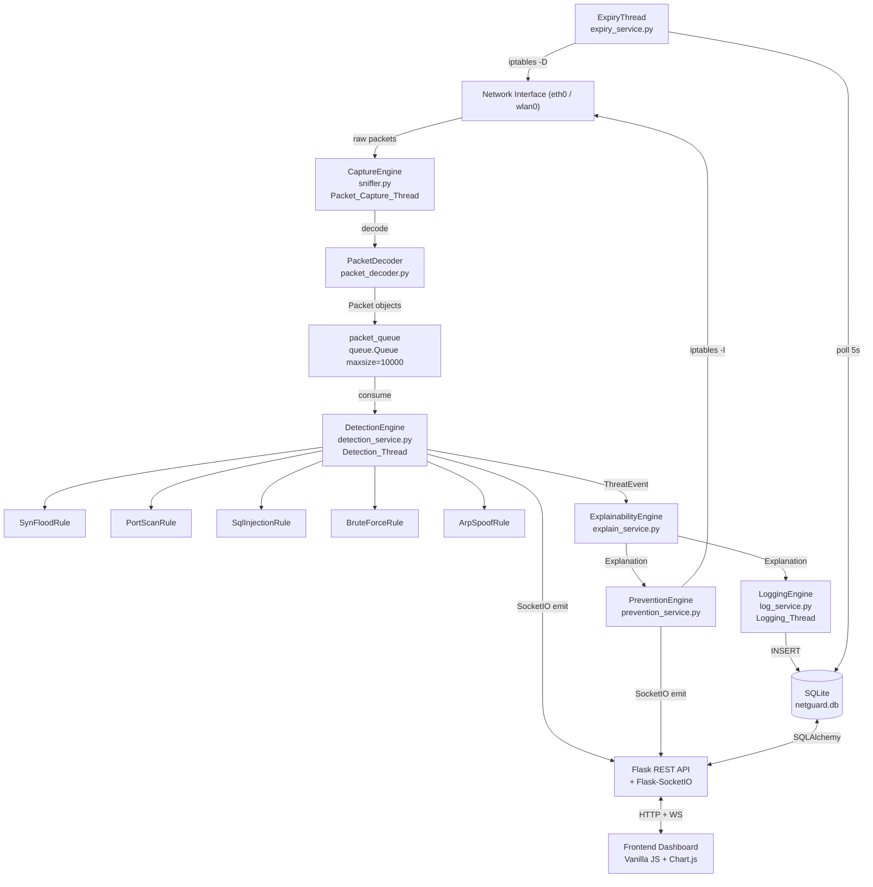
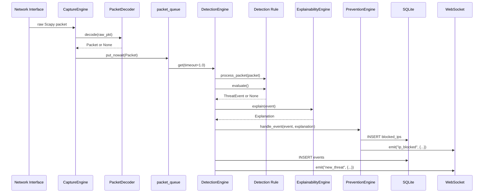

# NetGuard — Explainable Intrusion Detection & Prevention System

[](https://python.org)
[](#testing)
[](LICENSE)
[](https://flask.palletsprojects.com)
[](https://sqlalchemy.org)

NetGuard is a real-time, explainable Intrusion Detection and Prevention System (IDPS) that
captures live network traffic, detects five attack categories, generates plain-English
explanations for every alert, and automatically blocks attackers via iptables — all visible
through a live SOC-style dashboard.

Built for the **MVIC Build Nepal Hackathon 2026**. Runs entirely offline on a single Linux
machine. No cloud, no proprietary hardware, no agents.

---

## Table of Contents

1. [Features](#features)
2. [Architecture](#architecture)
3. [Directory Structure](#directory-structure)
4. [Prerequisites](#prerequisites)
5. [Installation](#installation)
6. [Configuration](#configuration)
7. [Running NetGuard](#running-netguard)
8. [API Reference](#api-reference)
9. [Detection Rules](#detection-rules)
10. [Service Layer](#service-layer)
11. [Database Schema](#database-schema)
12. [Testing](#testing)
13. [Demo Attack Scripts](#demo-attack-scripts)
14. [Technology Stack](#technology-stack)

---

## Features

| Feature | Detail |
|---------|--------|
| Live packet capture | Scapy-based; TCP, UDP, ICMP, ARP on any OS interface |
| 5 detection rules | SYN Flood, Port Scan, SQL Injection, Brute Force, ARP Spoofing |
| Explainable alerts | Plain-English text, severity, confidence 0–100, actionable recommendation |
| Auto-blocking | iptables DROP rule applied within seconds of detection |
| Auto-expiry | Background thread removes expired blocks every 5 seconds |
| Whitelist | Trusted IPs bypass blocking; O(1) in-memory set lookup |
| REST API | 21 endpoints — monitor, detect, block, whitelist, stats, logs, settings |
| Live dashboard | WebSocket KPIs, traffic chart, severity chart, threat timeline |
| SQLite persistence | Events, blocks, whitelist, settings, logs via SQLAlchemy ORM |
| 511 tests | Unit + property-based (Hypothesis) + integration |
| Rotating log files | system.log, detections.log, errors.log — max 10 MB each, 5 backups |


---

## Architecture

### System Overview




### Threading Model

| Thread | Module | Role |
|--------|--------|------|
| `Packet_Capture_Thread` | `detection/capture/sniffer.py` | Scapy `sniff()` → decodes packets → puts onto `packet_queue` |
| `Detection_Thread` | `backend/services/detection_service.py` | Consumes `packet_queue` → runs all 5 rules → emits `ThreatEvent` via callback |
| `Logging_Thread` | `backend/services/log_service.py` | Consumes `event_queue` → persists to SQLite and log files |
| `Expiry_Thread` | `backend/services/expiry_service.py` | Polls DB every 5 s → removes expired iptables rules |
| `API_Thread` | Flask + eventlet | Serves HTTP REST + WebSocket |

### Packet Flow




---

## Directory Structure

```
NetGuard/
├── backend/
│   ├── api/
│   │   ├── __init__.py          # Flask app factory + SocketIO init
│   │   └── dependencies.py      # Service registry (populated by main.py)
│   ├── repositories/
│   │   ├── event_repository.py  # CRUD for events table
│   │   ├── block_repository.py  # CRUD for blocked_ips table
│   │   ├── whitelist_repository.py
│   │   ├── log_repository.py
│   │   └── settings_repository.py
│   ├── routes/
│   │   ├── health_routes.py     # GET /health, GET /status
│   │   ├── monitor_routes.py    # POST /monitor/start|stop, GET /monitor/interfaces
│   │   ├── detection_routes.py  # GET /detections, GET /detections/{id}, POST /detect
│   │   ├── block_routes.py      # POST /block|/unblock, GET /blocked
│   │   ├── whitelist_routes.py  # GET|POST /whitelist, DELETE /whitelist/{ip}
│   │   ├── dashboard_routes.py  # GET /dashboard, GET /dashboard/live
│   │   ├── stats_routes.py      # GET /statistics, GET /statistics/rules
│   │   ├── evidence_routes.py   # GET /evidence/{id}
│   │   ├── logs_routes.py       # GET /logs
│   │   └── settings_routes.py   # GET|PUT /settings
│   ├── services/
│   │   ├── config_service.py    # ConfigurationManager — loads/validates config.yaml
│   │   ├── detection_service.py # DetectionEngine — packet→rule→event pipeline
│   │   ├── explain_service.py   # ExplainabilityEngine — ThreatEvent→Explanation
│   │   ├── prevention_service.py# PreventionEngine — iptables block/unblock
│   │   ├── expiry_service.py    # ExpiryThread — auto-removes expired blocks
│   │   ├── whitelist_service.py # WhitelistManager — O(1) in-memory lookup
│   │   ├── monitor_service.py   # MonitorService — start/stop/interface management
│   │   ├── log_service.py       # LoggingEngine — async DB + file logging
│   │   └── stats_service.py     # StatsService — aggregation for dashboard
│   ├── utils/
│   │   ├── validators.py        # IP + numeric range validation
│   │   └── response.py          # Standard JSON envelope helpers
│   └── main.py                  # Application entry point + startup sequence
├── database/
│   ├── schema.py                # SQLAlchemy ORM models (6 tables)
│   └── init_db.py               # initialize_db() — creates tables + seeds defaults
├── detection/
│   ├── capture/
│   │   └── sniffer.py           # CaptureEngine — Scapy sniff() wrapper
│   ├── parsers/
│   │   └── packet_decoder.py    # PacketDecoder — raw Scapy → normalized Packet
│   └── rules/
│       ├── base_rule.py         # BaseRule ABC + ThreatEvent + Explanation dataclasses
│       ├── syn_flood.py         # SynFloodRule
│       ├── port_scan.py         # PortScanRule
│       ├── sql_injection.py     # SqlInjectionRule
│       ├── brute_force.py       # BruteForceRule
│       └── arp_spoof.py         # ArpSpoofRule
├── frontend/
│   ├── css/dark-theme.css
│   ├── js/                      # socket.js, api.js, dashboard.js, charts.js, ...
│   ├── index.html               # Main dashboard (KPIs, charts, threat timeline)
│   ├── blocked.html             # Active blocks management
│   ├── whitelist.html           # Whitelist management
│   ├── threats.html             # Full threat list with filters
│   ├── logs.html                # Log viewer
│   ├── rules.html               # Detection rule configuration
│   ├── settings.html            # System settings form
│   └── about.html               # Architecture overview
├── config/
│   └── config.yaml              # Runtime configuration (thresholds, interface, etc.)
├── demo/
│   ├── attack_syn.sh            # hping3 SYN flood demo
│   ├── attack_scan.sh           # nmap port scan demo
│   ├── attack_sql.sh            # curl SQL injection demo
│   ├── attack_bruteforce.sh     # hydra brute force demo
│   └── attack_arp.sh            # arpspoof ARP spoofing demo
├── docs/
│   ├── API.md                   # Full REST API reference
│   ├── ARCHITECTURE.md          # Detailed architecture with Mermaid diagrams
│   ├── DATABASE.md              # Database schema reference
│   ├── DEPLOYMENT.md            # Production deployment guide
│   ├── TROUBLESHOOTING.md       # Common problems and solutions
│   └── ROADMAP.md               # Feature roadmap
├── logs/                        # Rotating log files (auto-created)
├── scripts/
│   ├── setup.sh                 # One-shot setup script
│   └── start_demo.sh            # Full demo launcher
├── tests/                       # 511 unit + property-based + integration tests
├── .env                         # Environment variables
├── .env.example                 # Environment variable documentation
├── requirements.txt             # Pinned Python dependencies
├── CHANGELOG.md                 # Version history
├── CONTRIBUTING.md              # Contributor guide
└── SECURITY.md                  # Security policy and threat model
```


---

## Prerequisites

- **Python 3.11+** (tested on 3.11, 3.12, 3.14)
- **Linux** (required for iptables-based blocking; detection and API work on Windows/macOS in mock mode)
- **Root / sudo** (required for Scapy raw socket capture and iptables)
- **iptables** (pre-installed on most Linux distributions)

### Optional tools (demo scripts only)

| Tool | Script | Install |
|------|--------|---------|
| `hping3` | `demo/attack_syn.sh` | `sudo apt install hping3` |
| `nmap` | `demo/attack_scan.sh` | `sudo apt install nmap` |
| `hydra` | `demo/attack_bruteforce.sh` | `sudo apt install hydra` |
| `arpspoof` | `demo/attack_arp.sh` | `sudo apt install dsniff` |
| `curl` | `demo/attack_sql.sh` | usually pre-installed |

---

## Installation

```bash
# 1. Clone the repository
git clone https://github.com/Midvaley/midvalleyproject.git
cd midvalleyproject

# 2. Create a virtual environment (recommended)
python -m venv .venv
source .venv/bin/activate        # Linux/macOS
# .venv\Scripts\activate         # Windows

# 3. Automated setup (Linux, requires sudo)
sudo bash scripts/setup.sh

# ── OR install manually ────────────────────────────────────────────────────
pip install -r requirements.txt
python -c "from database.init_db import initialize_db; initialize_db()"

# 4. Copy and edit environment variables
cp .env.example .env
# Edit .env as needed
```

---

## Configuration

All runtime settings live in **`config/config.yaml`**. Edit this file to tune
thresholds without touching source code. Changes submitted via
`PUT /api/v1/settings` take effect immediately without restart.

```yaml
# config/config.yaml

network_interface: ""           # Interface to capture on (e.g. eth0, wlan0)

syn_flood_threshold: 100        # SYN packets per source IP to trigger detection
syn_flood_window: 3             # Sliding window in seconds (1–60)

port_scan_threshold: 20         # Unique ports per source IP to trigger detection
port_scan_window: 10            # Sliding window in seconds (1–60)

brute_force_threshold: 10       # Auth failures per source IP to trigger detection
brute_force_window: 60          # Sliding window in seconds (1–300)

block_duration: 120             # Auto-block duration in seconds (1–3600)

dashboard_refresh_interval: 1   # Dashboard polling interval in seconds (1–60)

rules_enabled:
  syn_flood: true
  port_scan: true
  sql_injection: true
  brute_force: true
  arp_spoof: true

debug: false
```

### Environment Variables

See [`.env.example`](.env.example) for full documentation. Key variables:

| Variable | Default | Description |
|----------|---------|-------------|
| `DATABASE_URL` | `sqlite:///database/netguard.db` | SQLAlchemy DB URL |
| `LOG_LEVEL` | `INFO` | Python logging level (DEBUG, INFO, WARNING, ERROR) |
| `SECRET_KEY` | `change-me-before-production` | Flask session secret |
| `FLASK_HOST` | `0.0.0.0` | Bind address |
| `FLASK_PORT` | `5000` | Listen port |
| `FLASK_ENV` | `development` | Flask environment |


---

## Running NetGuard

```bash
# Requires root for packet capture + iptables
sudo python backend/main.py

# Dashboard: http://localhost:5000
# API base:  http://localhost:5000/api/v1
```

### Startup Sequence (`backend/main.py`)

1. Eventlet monkey-patch (must be first import)
2. Load `config/config.yaml` via `ConfigurationManager`
3. Configure rotating log handlers via `setup_logging()`
4. Initialize SQLite database (`initialize_db()`)
5. Build repositories (EventRepository, BlockRepository, etc.)
6. Build services (LoggingEngine, WhitelistManager, PreventionEngine, etc.)
7. Verify iptables privileges (`PreventionEngine.verify_privileges()`)
8. Create Flask app + register all 10 route blueprints
9. Start `LoggingEngine` thread
10. Start `ExpiryThread`
11. Start `DetectionEngine` thread
12. Start live-stats SocketIO background task
13. `socketio.run()` — serves HTTP + WebSocket on `0.0.0.0:5000`

---

## API Reference

All endpoints are under `http://localhost:5000/api/v1`.

**Response envelope** (every response):
```json
// Success
{ "success": true, "message": "OK", "data": { ... } }

// Error
{ "success": false, "error": "Description", "code": 422, "error_code": "VALIDATION_ERROR" }
```

### Endpoint Summary

| Method | Path | Description |
|--------|------|-------------|
| `GET` | `/health` | Liveness check — `{"status":"healthy","version":"1.0.0","uptime":"HH:MM:SS"}` |
| `GET` | `/status` | Monitoring status, uptime, thread states, packet/block counts |
| `POST` | `/monitor/start` | Start packet capture: `{"interface":"eth0"}` |
| `POST` | `/monitor/stop` | Stop packet capture |
| `GET` | `/monitor/interfaces` | List all available network interfaces from the OS |
| `GET` | `/dashboard` | Full snapshot: KPIs + recent 20 events + active blocks + attack counts |
| `GET` | `/dashboard/live` | Lightweight: `packets_per_second`, `active_threats`, `alerts_today`, `monitoring` |
| `GET` | `/detections` | Paginated list; query params: `severity`, `attack_type`, `source_ip`, `date`, `limit`, `offset` |
| `GET` | `/detections/<event_id>` | Single detection by UUID |
| `POST` | `/detect` | Submit detection event manually |
| `GET` | `/evidence/<event_id>` | Full `Explanation` object for a detection |
| `POST` | `/block` | Block an IP: `{"ip":"10.0.0.1","reason":"manual","duration":120}` |
| `POST` | `/unblock` | Unblock: `{"ip":"10.0.0.1"}` |
| `GET` | `/blocked` | All active blocks with `expires_in` countdown in seconds |
| `GET` | `/whitelist` | List all trusted IPs |
| `POST` | `/whitelist` | Add trusted IP: `{"ip":"192.168.1.1","description":"gateway"}` |
| `DELETE` | `/whitelist/<ip>` | Remove IP from whitelist |
| `GET` | `/statistics` | Aggregate counts by attack type and severity |
| `GET` | `/statistics/rules` | Per-rule detection counts |
| `GET` | `/logs` | Paginated system logs; filter by `severity`, `date`, `module`, `source_ip` |
| `GET` | `/settings` | Return current configuration as JSON |
| `PUT` | `/settings` | Update thresholds; out-of-range values → 422 VALIDATION_ERROR |

Full API documentation: [`docs/API.md`](docs/API.md)


---

## Detection Rules

### SynFloodRule (`detection/rules/syn_flood.py`)

Detects TCP SYN flood attacks by counting pure SYN packets (flag `S`, no `A`) per
source IP within a sliding window.

| Method | Signature | Description |
|--------|-----------|-------------|
| `initialize()` | `() → None` | Clears `_flows` dict and `_cooldown` dict |
| `process_packet(packet)` | `(Packet) → None` | If TCP SYN (not SYN-ACK), appends `(timestamp, dst_ip)` to per-IP deque |
| `evaluate()` | `() → Optional[ThreatEvent]` | Evicts entries older than `window_seconds`; returns first IP exceeding threshold |
| `explain(event)` | `(ThreatEvent) → Explanation` | `"Detected {count} SYN packets from {ip} within {window}s…"` |
| `cleanup()` | `() → None` | Clears all state |

**Severity tiers:** 100–199 → Medium · 200–399 → High · ≥400 → Critical  
**Confidence formula:** `round(min(count/threshold, 2.0) / 2.0 * 100)` capped at 100  
**Evidence fields:** `source_ip`, `syn_packet_count`, `time_window_seconds`, `threshold`, `destination_ips`, `sample_timestamps` (≤5)

---

### PortScanRule (`detection/rules/port_scan.py`)

Detects port scanning by tracking unique `(dst_ip, dst_port)` pairs per source IP.

| Method | Signature | Description |
|--------|-----------|-------------|
| `initialize()` | `() → None` | Clears `_flows` and `_cooldown` |
| `process_packet(packet)` | `(Packet) → None` | Records `(epoch, dst_ip, dst_port)` for TCP/UDP packets |
| `evaluate()` | `() → Optional[ThreatEvent]` | Evicts stale entries; fires when unique port count ≥ threshold |
| `explain(event)` | `(ThreatEvent) → Explanation` | `"Detected connection attempts to {count} unique ports from {ip} within {window}s…"` |

**Severity tiers:** 20–39 → Medium · 40–79 → High · ≥80 → Critical  
**Evidence fields:** `source_ip`, `scanned_ports` (capped at 20), `unique_port_count`, `time_window_seconds`, `confidence_score`

---

### SqlInjectionRule (`detection/rules/sql_injection.py`)

Detects SQL injection payloads in HTTP traffic (ports 80, 443, 8080, 8443).

| Method | Signature | Description |
|--------|-----------|-------------|
| `initialize()` | `() → None` | Clears `_seen_ips` set and `_pending` list |
| `process_packet(packet)` | `(Packet) → None` | Decodes TCP payload as UTF-8; searches for any SQL pattern; first hit from IP → High; repeat → Critical |
| `evaluate()` | `() → Optional[ThreatEvent]` | Pops and returns first pending ThreatEvent |
| `explain(event)` | `(ThreatEvent) → Explanation` | `"Detected SQL injection pattern '{pattern}' in HTTP request from {src} to {dst}…"` |

**Patterns detected:** `' OR`, `UNION SELECT`, `DROP TABLE`, `--`, `xp_cmdshell`  
**Confidence:** always 100 (single match = definitive evidence)  
**Evidence fields:** `source_ip`, `destination_ip`, `http_method`, `request_url`, `matched_pattern`

---

### BruteForceRule (`detection/rules/brute_force.py`)

Detects brute-force login attempts by tracking TCP connections to auth ports.

| Method | Signature | Description |
|--------|-----------|-------------|
| `initialize()` | `() → None` | Clears `_flows` and `_cooldown` |
| `process_packet(packet)` | `(Packet) → None` | Records `(epoch, dst_port)` for TCP to ports 21, 22, 80, 443 |
| `evaluate()` | `() → Optional[ThreatEvent]` | Evicts stale entries; fires when count ≥ threshold |
| `explain(event)` | `(ThreatEvent) → Explanation` | `"Detected {count} authentication failures from {ip} within {window}s targeting {service}…"` |

**Service mapping:** 22 → `SSH` · 21 → `FTP` · 80/443 → `HTTP` · other → `Unknown`  
**Severity tiers:** 10–19 → Medium · 20–39 → High · ≥40 → Critical  
**Evidence fields:** `source_ip`, `failure_count`, `time_window_seconds`, `threshold`, `target_service`

---

### ArpSpoofRule (`detection/rules/arp_spoof.py`)

Detects ARP spoofing by identifying conflicting MAC addresses for the same IP.

| Method | Signature | Description |
|--------|-----------|-------------|
| `initialize()` | `() → None` | Clears all tracking dicts and pending list |
| `process_packet(packet)` | `(Packet) → None` | For ARP only: records `packet.hw_src` in per-IP MAC set; queues event when `len(macs) >= 2` |
| `evaluate()` | `() → Optional[ThreatEvent]` | Pops and returns next pending ThreatEvent |
| `explain(event)` | `(ThreatEvent) → Explanation` | `"Detected conflicting ARP responses for IP {ip}: MAC addresses {macs}…"` |

**Severity:** always `High`  
**Confidence:** 97 for exactly 2 conflicting MACs · 100 for ≥3 MACs  
**Evidence fields:** `conflicting_ip`, `conflicting_macs`, `mac_count`, `first_observed_timestamp`, `most_recent_timestamp`


---

## Service Layer

### DetectionEngine (`backend/services/detection_service.py`)

| Method / Property | Description |
|-------------------|-------------|
| `start()` | Builds rule instances, calls `rule.initialize()` on each, starts `Detection_Thread` |
| `stop()` | Puts stop sentinel on queue, joins thread (5 s timeout), calls `rule.cleanup()` |
| `reload_rules()` | Rebuilds all rule instances from current config; clears `_disabled_rules` |
| `_dispatch(packet)` | Runs `process_packet()` + `evaluate()` per rule; disables faulty rules on exception |
| `_should_emit(event)` | Returns True if: no prior cooldown entry, OR cooldown expired (≥10 s), OR severity escalated |
| `is_running` | `bool` — True if Detection_Thread is alive |
| `active_rule_names` | `list[str]` — enabled rules not disabled by exception |
| `disabled_rule_names` | `list[str]` — rules disabled due to runtime exceptions this session |

---

### ExplainabilityEngine (`backend/services/explain_service.py`)

Converts `ThreatEvent → Explanation` within 50 ms. Never raises to caller.

| Method | Description |
|--------|-------------|
| `explain(event)` | Entry point; returns fallback `Explanation` on any internal error |
| `_build_text(event)` | Selects attack-type template; fills from `event.evidence`; generic fallback for unknown types |
| `_get_recommendation(attack_type)` | Returns exact per-type recommendation string |
| `_check_whitelist(ip)` | Returns `True` if IP is whitelisted; returns `False` on any error |
| `_fallback_explanation(event)` | Returns `"A security event was detected. Details unavailable due to an internal error."` |

---

### PreventionEngine (`backend/services/prevention_service.py`)

| Method | Description |
|--------|-------------|
| `verify_privileges()` | Runs `iptables -L INPUT -n`; raises `RuntimeError` if return code ≠ 0 |
| `handle_event(event, explanation)` | Checks whitelist; if not whitelisted, calls `block_ip()` |
| `block_ip(ip, reason, event_id)` | Extends expiry if already blocked; otherwise issues `iptables -I INPUT -s {ip} -j DROP`; inserts DB record; emits `ip_blocked` SocketIO |
| `unblock_ip(ip)` | Issues `iptables -D INPUT -s {ip} -j DROP`; sets DB record inactive; emits `ip_unblocked` |
| `set_block_duration(duration)` | Clamps to `[1, 3600]` and updates `_block_duration` |

---

### WhitelistManager (`backend/services/whitelist_service.py`)

| Method | Description |
|--------|-------------|
| `is_whitelisted(ip)` | O(1) lookup in `_ip_set` (never queries DB) |
| `add(ip, description, created_by)` | Validates IP; inserts to DB; updates in-memory set; raises `ValueError` on bad IP |
| `remove(ip)` | Deletes from DB; discards from in-memory set; returns `False` if not found |
| `get_all()` | Returns all entries from DB with all fields |
| `sync_from_db()` | Rebuilds `_ip_set` from DB; safe to call on any failure |

---

### LoggingEngine (`backend/services/log_service.py`)

Async logging. `log_event()` is non-blocking (enqueues for `Logging_Thread`).

| Method | Description |
|--------|-------------|
| `start()` | Starts `Logging_Thread`; writes STARTUP to system.log |
| `stop()` | Sends stop sentinel; joins thread (5 s); writes SHUTDOWN |
| `log_event(event, explanation)` | Writes to `detections.log` synchronously; enqueues for async DB insert |
| `log_block(ip, reason, duration)` | Writes BLOCK to `detections.log`; persists to `system_logs` |
| `log_unblock(ip, reason)` | Writes UNBLOCK to `detections.log`; persists to `system_logs` |
| `log_system(level, module, event, message, metadata)` | Writes to `system.log`; mirrors WARNING+ to `errors.log`; strips sensitive metadata keys |

**Three rotating log files** (max 10 MB each, 5 backups):  
`logs/system.log` · `logs/detections.log` · `logs/errors.log`

---

### ExpiryThread (`backend/services/expiry_service.py`)

| Method | Description |
|--------|-------------|
| `start()` | Spawns `Expiry_Thread` daemon; idempotent |
| `stop()` | Sets stop event; joins thread (10 s timeout) |
| `_process_expired_blocks()` | Queries `block_repo.get_expired()`; for each: iptables -D, set_inactive(), log_unblock(), emit `ip_unblocked` |

Poll interval: 5 seconds (`POLL_INTERVAL = 5`).

---

### ConfigurationManager (`backend/services/config_service.py`)

| Method | Description |
|--------|-------------|
| `load()` | Reads `config/config.yaml`; on parse error falls back to built-in defaults and logs CRITICAL |
| `get(key)` | Thread-safe read of a single setting by field name |
| `update(updates)` | Validates ranges; applies in-memory; persists to `config.yaml` |
| `validate_settings(updates)` | Returns list of invalid field names; empty list = all valid |

Valid ranges: `syn_flood_threshold` ≥1 · `syn_flood_window` 1–60 · `port_scan_threshold` ≥1 · `port_scan_window` 1–60 · `brute_force_threshold` ≥1 · `brute_force_window` 1–300 · `block_duration` 1–3600 · `dashboard_refresh_interval` 1–60


---

## Database Schema

Six SQLAlchemy ORM tables in `database/schema.py`:

| Table | Purpose |
|-------|---------|
| `events` | Every detected threat event with evidence, explanation, and recommendation |
| `blocked_ips` | Active and historical firewall blocks with expiration timestamps |
| `whitelist` | Trusted IPs that bypass automatic blocking |
| `detection_rules` | Configurable rules with thresholds, severity, and enabled status |
| `settings` | Key-value configuration store (mirrors `config.yaml`) |
| `system_logs` | Operational log entries for the dashboard log viewer |

See [`docs/DATABASE.md`](docs/DATABASE.md) for full column documentation.

---

## Testing

```bash
# Run all 511 tests with coverage
pytest --cov=backend --cov=detection --cov=database --cov-report=term-missing

# Run only unit tests (fast, no network)
pytest tests/ -k "not integration"

# Run property-based tests
pytest tests/ -k "hypothesis"
```

The test suite includes:
- **Unit tests** — each service and detection rule tested in isolation
- **Property-based tests** — Hypothesis strategies for IP validation, severity tiers, confidence formulas
- **Integration tests** — full API endpoint tests with a real Flask test client and in-memory SQLite
- **Router tests** — every route blueprint tested with mocked services

---

## Demo Attack Scripts

Run these from a second terminal while NetGuard is active to see live detections:

```bash
# SYN Flood (requires hping3)
sudo bash demo/attack_syn.sh

# Port Scan (requires nmap)
bash demo/attack_scan.sh

# SQL Injection (requires curl — pre-installed)
bash demo/attack_sql.sh

# Brute Force (requires hydra)
bash demo/attack_bruteforce.sh

# ARP Spoofing (requires arpspoof from dsniff)
sudo bash demo/attack_arp.sh
```

Or launch all at once:
```bash
sudo bash scripts/start_demo.sh
```

---

## Technology Stack

| Component | Technology | Version |
|-----------|------------|---------|
| REST API | Flask | 3.0.3 |
| WebSocket | Flask-SocketIO + eventlet | 5.3.6 + 0.36.1 |
| Packet capture | Scapy | 2.5.0 |
| Database ORM | SQLAlchemy | 2.0.51 |
| Database | SQLite | (stdlib) |
| Config | PyYAML | 6.0.2 |
| Environment | python-dotenv | 1.0.1 |
| System info | psutil | 6.1.0 |
| Testing | pytest + Hypothesis | 8.3.3 + 6.115.6 |
| Frontend | Vanilla JS ES6 + Chart.js + Socket.IO client | — |

---

## License

MIT License — see [LICENSE](LICENSE)

## Contributing

See [CONTRIBUTING.md](CONTRIBUTING.md) for development setup, coding standards, and PR process.

## Security

See [SECURITY.md](SECURITY.md) for the threat model and vulnerability reporting policy.
