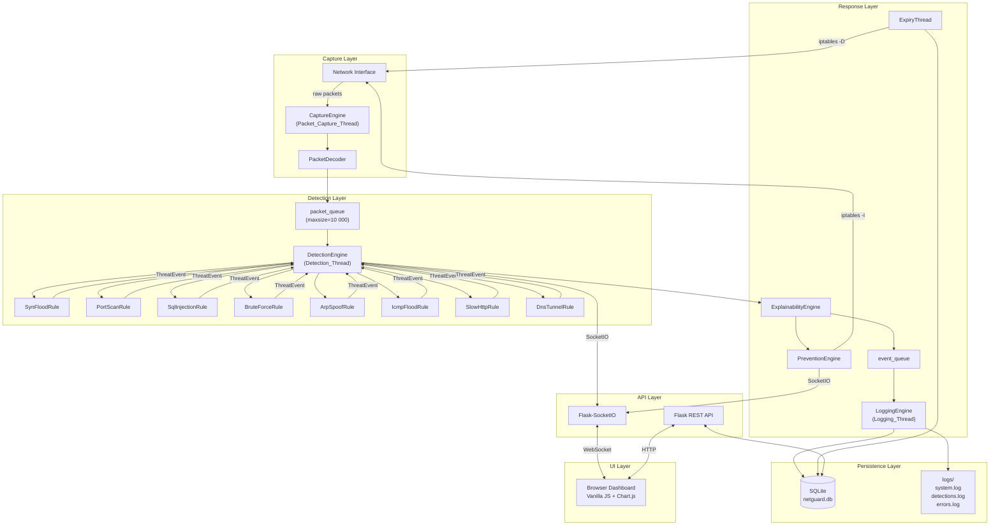
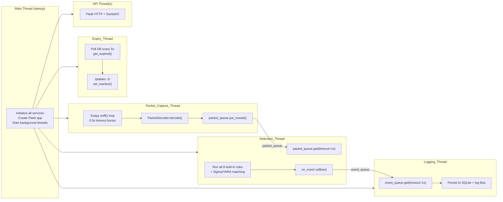
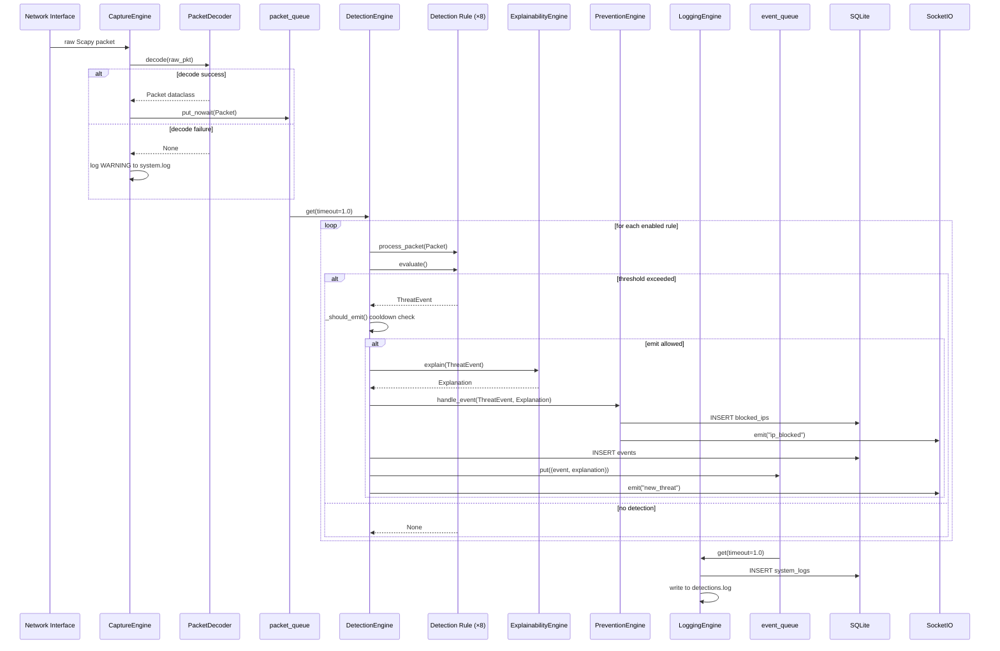
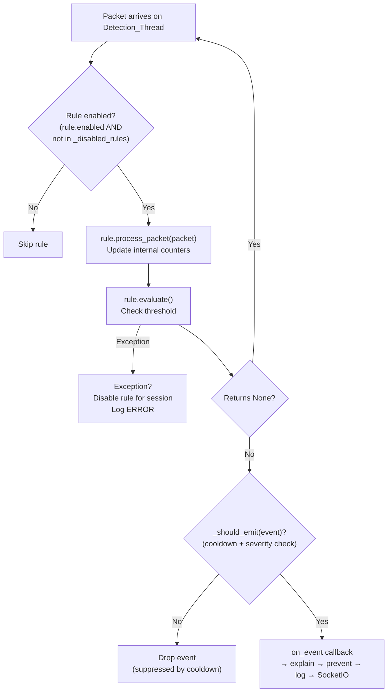
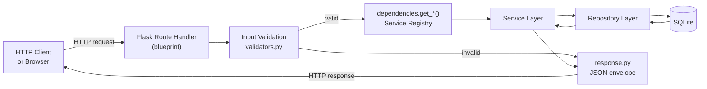
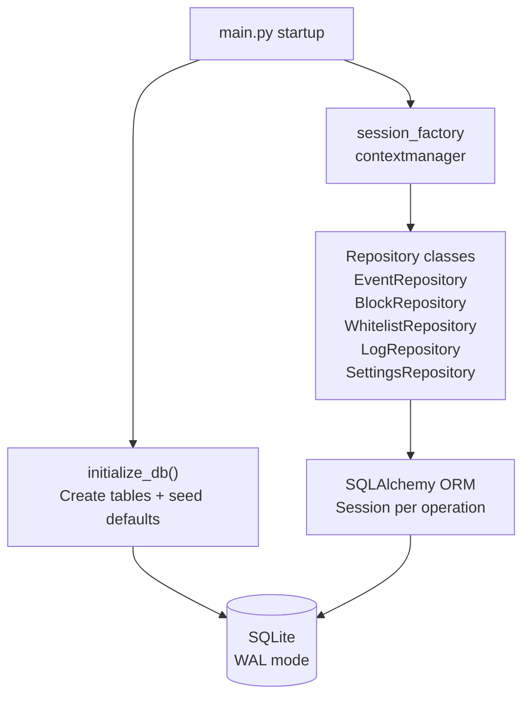
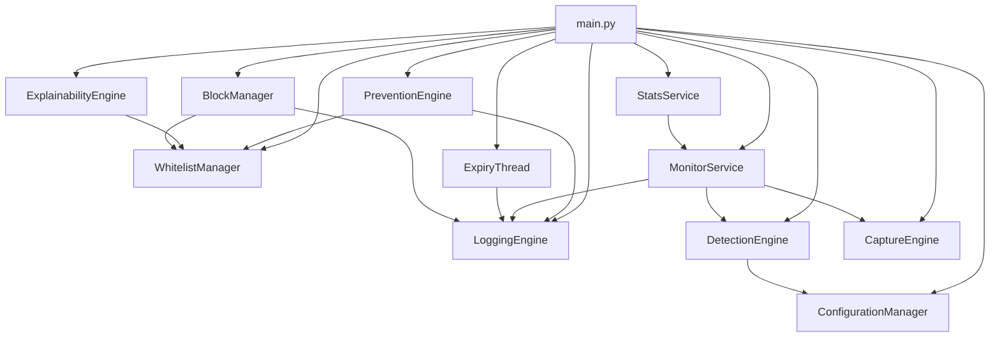

# NetGuard Architecture

This document describes the internal design of NetGuard IDPS at the component,
thread, and data-flow levels.

---

## Table of Contents

1. [Overall Architecture](#overall-architecture)
2. [Threading Model](#threading-model)
3. [Packet Flow](#packet-flow)
4. [Detection Pipeline](#detection-pipeline)
5. [API Flow](#api-flow)
6. [Database Flow](#database-flow)
7. [Service Dependencies](#service-dependencies)
8. [Key Design Decisions](#key-design-decisions)

---

## Overall Architecture

---

## Threading Model

NetGuard runs a main thread plus these background threads. All inter-thread
communication is via `queue.Queue` (packet_queue, event_queue) or
`threading.Event` (stop signals).

| Thread | Owner | Purpose |
|--------|-------|---------|
| `Packet_Capture_Thread` | CaptureEngine | Scapy sniff loop → decode → packet_queue |
| `Detection_Thread` | DetectionEngine | packet_queue → rules → on_event callback |
| `Logging_Thread` | LoggingEngine | event_queue → SQLite + log files |
| `Expiry_Thread` | ExpiryThread | Poll DB every 5s, remove expired blocks |
| `SigmaWatcher` | DetectionEngine | Hot-reload Sigma rules on file mtime change |
| `ThreatIntelWorker` | ThreatIntelService | Background feed refresh |
| Attack-lab session threads | AttackLabService | One daemon thread per running simulation |
| APScheduler pool (10) | SchedulerService | Scheduled attack jobs (when started) |
| API thread(s) | Flask-SocketIO | HTTP + WebSocket (eventlet on Linux, threading on Windows) |

### Thread Safety

| Resource | Protection |
|----------|------------|
| `packet_queue` | `queue.Queue` (thread-safe by design) |
| `event_queue` | `queue.Queue` (thread-safe by design) |
| `WhitelistManager._ip_set` | `threading.RLock` |
| `MonitoringState` fields | `threading.Lock` (via `increment_packets`) |
| `StatsService._pkt_timestamps` | `threading.Lock` |
| `ConfigurationManager._settings` | `threading.Lock` |
| SQLite connections | `check_same_thread=False` + session-per-operation |

---

## Packet Flow

---

## Detection Pipeline

Each detection rule implements the `BaseRule` interface:

### Cooldown Logic

The `_should_emit()` method in `DetectionEngine` prevents alert storms:

- Default cooldown: **10 seconds** per `(source_ip, rule_name)` pair
- Within the cooldown window, a new event is emitted **only if** its severity
  is strictly higher than the previously emitted severity
- Example: Medium at t=0 → suppressed at t=3 (same severity) → High at t=7 is
  emitted (escalation) → suppressed at t=9 (same High) → cooldown expires at t=10

### Rule Exception Isolation

If `process_packet()` or `evaluate()` raises an uncaught exception, the
DetectionEngine:
1. Logs the exception at ERROR level with `exc_info=True`
2. Adds the rule's `rule_name` to `_disabled_rules`
3. Continues processing all other rules
4. Exposes the disabled rule name via `disabled_rule_names` property
5. Restores the rule on the next `reload_rules()` call

### Active Detection Rules

| Rule | ID | Attack Type | Phase |
|------|----|-------------|-------|
| `SynFloodRule` | `SYN_FLOOD_001` | TCP SYN Flood | Baseline |
| `PortScanRule` | `PORT_SCAN_001` | Port Reconnaissance | Baseline |
| `SqlInjectionRule` | `SQL_INJECT_001` | SQL Injection (HTTP) | Baseline |
| `BruteForceRule` | `BRUTE_FORCE_001` | Brute Force Login | Baseline |
| `ArpSpoofRule` | `ARP_SPOOF_001` | ARP Spoofing / MitM | Baseline |
| `IcmpFloodRule` | `ICMP_FLOOD_001` | ICMP Flood / Smurf Attack | Phase B |
| `SlowHttpRule` | `SLOW_HTTP_001` | Slow HTTP / Slowloris | Phase B |
| `DnsTunnelRule` | `DNS_TUNNEL_001` | DNS Tunneling (heuristic) | Phase B |

### Sigma and YARA Rules

In addition to the 8 built-in Python rules, DetectionEngine loads:

- **Sigma rules** — YAML files from `rules/sigma/` (or `ai.sigma_rules_dir`
  config override). Matched against serialised events via a lightweight
  condition evaluator (not full pySigma algebra). A `SigmaWatcher` daemon
  thread polls file mtimes and hot-reloads on change.
- **YARA rules** — compiled from the configured directory and matched against
  packet payloads when the `yara` package is available.

---

## API Flow

Route handlers are intentionally thin. The pattern is:

1. Parse and validate request input
2. Retrieve the service via `dependencies.get_*()`
3. Call one service method
4. Return `success_response()` or `error_response()` from `response.py`

No business logic lives in route handlers.

### API Surface

28 blueprints are registered under `/api/v1` in
[backend/api/__init__.py](../backend/api/__init__.py):

| Group | Blueprints |
|-------|-----------|
| Core IDPS | health, monitor, detection, block, blocks_v2, whitelist, evidence |
| Visibility | dashboard, stats, logs, timeline, analytics, map, hunt |
| Config & auth | settings, auth, audit, reset, plugins |
| Reporting | export, reports, advisor, ai, ai_assistant |
| Lab & LAN | lab, scheduler, lan_devices |

### Before-Request Chain

Incoming HTTP requests pass through three `before_request` hooks (registered in
`create_app()`) before reaching any route handler:

| Order | Hook | Purpose |
|-------|------|---------|
| 1 | `sanitise_and_validate()` | Reject oversized or malformed input fields |
| 2 | `RateLimiter.check()` | Rate-limit per client IP (gated on `TRUST_PROXY_HEADERS`) |
| 3 | `ApiKeyAuth.check()` | Authenticate mutating requests via `X-API-Key` header |

After the route handler returns, `add_security_headers()` runs as an
`after_request` hook and appends CSP, HSTS (HTTPS only), and Permissions-Policy
response headers.

---

## Database Flow

Each repository receives `session_factory` (a context manager) as a
constructor argument. This keeps the session lifecycle inside the repository
and makes it straightforward to swap the session factory in tests.

---

## Service Dependencies

All services are instantiated in `main.py` and registered by name in
`backend/api/dependencies.py`. Route blueprints retrieve them via
`dependencies.get_*()` accessors. Services do not import each other — they
communicate via constructor injection, callbacks (`on_event`, `socketio_emit`),
or the shared queues.

### Core pipeline (wired in main.py)

### Extended services (registered in dependencies.py)

| Service | Depends on | Purpose |
|---------|-----------|---------|
| `AuditService` | session_factory | Audit trail of mutating API calls |
| `AuthService` | settings_repo, audit_service | API-key / login authentication |
| `AIExplainService` | — | LLM-assisted event explanation |
| `LanScanService` | — | LAN device discovery |
| `SecurityAdvisor` | — | Posture recommendations |
| `ComplianceReporter` | — | Compliance report generation |
| `ThreatSimulator` | whitelist set | Synthetic attack traffic generator |
| `AttackLabService` | packet_queue, threat_simulator | Lab sessions; daemon thread per session |
| `GeoIPEngine` | settings_repo | IP geolocation with cache + TTL |
| `ThreatIntelService` | event_repo, settings_repo, log_engine | Feed refresh on a daemon worker thread |
| `AnomalyEngine` | — | Statistical baseline anomaly detection |
| `PluginRegistry` | settings_repo | Third-party widget/plugin loading |
| `ExportService` | event_repo | Data export (CSV/JSON) |
| `SOAREngine` | settings_repo, log_engine, geoip_engine | Multi-channel alerting / SIEM forwarding |
| `SchedulerService` | attack_lab_service, log_engine | Scheduled attack jobs via APScheduler (SQLite jobstore) |

`SchedulerService` requires two extra startup steps in `main.py`:
`wire_session(session_factory)` after DB init, then `start()` in the
`__main__` block to launch APScheduler. Both scheduler and SOAR routes return
503 when the service is not registered.

---

## Key Design Decisions

### Why eventlet? (now platform-conditional)

Flask-SocketIO requires an async worker to serve WebSocket connections alongside
HTTP. On Linux, eventlet provides cooperative multitasking via green threads and
monkey-patches the standard library at startup — which is why `monkey_patch()`
must run before any other import.

On Windows, eventlet's patching of select/socket corrupts Scapy's pcap fd
handling and causes `monitor/start` to hang, so `main.py` forces
`SOCKETIO_ASYNC_MODE=threading` there instead. The same fallback applies on
Python 3.14+ where eventlet compatibility is not yet assumed.

### Why queue.Queue for inter-thread communication?

Direct calls from CaptureEngine to DetectionEngine would couple the two threads
and slow packet capture if detection is slow. The queue decouples them: capture
can run at full speed and detection processes at its own rate. The `maxsize=10000`
prevents unbounded memory growth under heavy load (packets are dropped with a WARNING
if the queue is full).

### Why SQLite?

Single-machine deployment, no multi-process writes, hackathon scope. WAL mode
provides good concurrent read performance for the dashboard queries while
detection writes happen. Replacing with PostgreSQL would require changing only
the `DATABASE_URL` and the `create_engine` call.

### Why separate log files per category?

`system.log` is for operations teams monitoring startup/shutdown and interface
changes. `detections.log` is for security analysts reviewing attack timelines.
`errors.log` is for developers debugging failures. Keeping them separate avoids
noisy cross-contamination and allows different log rotation or alerting policies.
